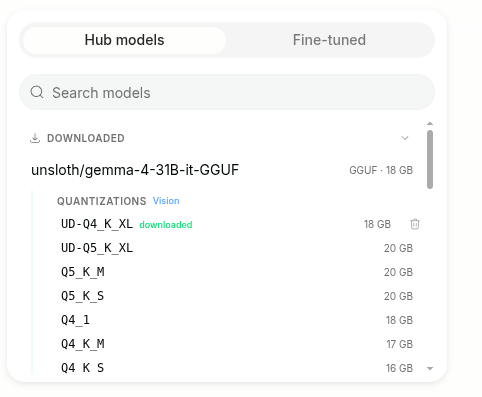
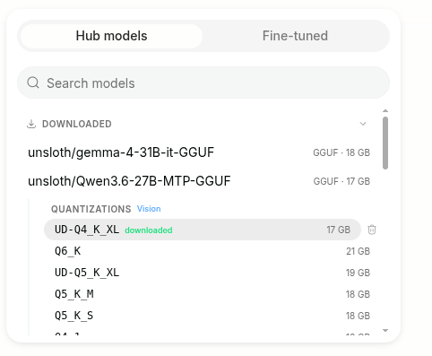

# How to Run MTP Models: Multi-Token Prediction Guide

The Unsloth documentation provides a comprehensive guide on how to run MTP models.

See this [guide](https://unsloth.ai/docs/models/mtp) for more details.

> [!NOTE] This guide is targeted for running models on one single NVIDIA 5090 GPU.

---
## Run with Unsloth Studio
See this [guide](https://unsloth.ai/docs/models/mtp#unsloth-studio-mtp-guide) for more details.

### 1. Install Unsloth
Run in your terminal:
```bash
curl -fsSL https://unsloth.ai/install.sh | sh
```

To update Unsloth Studio use the same commands as install:
```bash
curl -fsSL https://unsloth.ai/install.sh | sh
```

>[!NOTE] The installed folder is `~/.unsloth`.

### 2. Launch Unsloth
MacOS, Linux, WSL and Windows:
```bash
unsloth studio -H 127.0.0.1 -p 8888
```

Then open http://127.0.0.1:8888 (or your specific URL) in your browser.


### 3. Search and download your desired model
On first launch you will need to create a password to secure your account and sign in again later. 
>[!NOTE] Gemma 4 MTP is automatically enabled in Unsloth. You only need to download the regular original Gemma 4 GGUF. 

| Gemma 4 | Qwen3.6 MTP |
|:-:|:-:|
|  |  |


### 4. Run your MTP model
Inference, MTP and speculative decoding settings should be auto-set when using Unsloth Studio, however you can still change it manually. You can also edit speculative decoding, the context length, chat template and other settings in the right side bar.


---
## Run with Llama.cpp
See this [guide](https://unsloth.ai/docs/models/mtp#llama.cpp-mtp-guide) for more details.

### 1. Build Llama.cpp locally
See this official [Llama.cpp build guide](https://github.com/ggml-org/llama.cpp/blob/master/docs/build.md) for more details.

Install dependencies:
```bash
sudo apt-get update
sudo apt-get install pciutils build-essential cmake curl libcurl4-openssl-dev -y
```


Then build with CUDA support:
```bash
git clone https://github.com/ggml-org/llama.cpp
```                    

### 2. Manually downloading quants

Activate python environment and install hf:
```bash
source .venv/bin/activate
uv add huggingface_hub hf_transfer
mkdir -p ~/unsloth
```

Download Gemma 4 quants:
```bash
hf download unsloth/gemma-4-31B-it-GGUF \
    --local-dir ~/unsloth/gemma-4-31B-it-GGUF \
    --include "*mmproj-F16*" \
    --include "mtp-*" \
    --include "*UD-Q4_K_XL*" # Use "*UD-Q2_K_XL*" for Dynamic 2bit
```

Download Qwen3.6 MTP quants:
```bash
hf download unsloth/Qwen3.6-27B-MTP-GGUF \
    --local-dir ~/unsloth/Qwen3.6-27B-MTP-GGUF \
    --include "*mmproj-F16*" \
    --include "*UD-Q4_K_XL*" # Use "*UD-Q2_K_XL*" for Dynamic 2bit
```


### 3. Run the model in conversation mode:
Gemma 4 MTP:
```bash
cd ~
./llama.cpp/llama-cli \
    --model unsloth/gemma-4-31B-it-GGUF/gemma-4-31B-it-UD-Q4_K_XL.gguf \
    --mmproj unsloth/gemma-4-31B-it-GGUF/mmproj-F16.gguf \
    --model-draft unsloth/gemma-4-31B-it-GGUF/mtp-gemma-4-31B-it.gguf \
    --temp 1.0 \
    --top-p 0.95 \
    --top-k 64  \
    --spec-type draft-mtp --spec-draft-n-max 2 \
    -c 16384
```

Qwen3.6 MTP:
```bash
cd ~
./llama.cpp/llama-cli \
    --model unsloth/Qwen3.6-27B-MTP-GGUF/Qwen3.6-27B-UD-Q4_K_XL.gguf \
    --mmproj unsloth/Qwen3.6-27B-MTP-GGUF/mmproj-F16.gguf \
    --temp 1.0 \
    --top-p 0.95 \
    --min-p 0.00 \
    --top-k 20 \
    --spec-type draft-mtp --spec-draft-n-max 2 \
    -c 16384
```

**Testing:** the command drops into an interactive chat — just type a prompt and press Enter:
```text
> Introduce yourself in one sentence.
```
To confirm MTP speculative decoding is active, check the startup log for:
```text
common_speculative_impl_draft_mtp: adding speculative implementation 'draft-mtp'
```
On exit, llama.cpp prints timing stats; a higher `draft accepted / draft total` ratio means MTP is helping more.


### 4.Llama-server deployment
To deploy Gemma-4 on llama-server, use:
```bash
cd ~
./llama.cpp/llama-server \
    --model unsloth/gemma-4-31B-it-GGUF/gemma-4-31B-it-UD-Q4_K_XL.gguf \
    --mmproj unsloth/gemma-4-31B-it-GGUF/mmproj-F16.gguf \
    --model-draft unsloth/gemma-4-31B-it-GGUF/mtp-gemma-4-31B-it.gguf \
    --temp 1.0 \
    --top-p 0.95 \
    --top-k 64  \
    --alias "unsloth/gemma-4-31B-it-GGUF" \
    --port 8001 \
    --reasoning on \
    -fa on -c 16384 --parallel 1 \
    --spec-type draft-mtp --spec-draft-n-max 2
```

> Notes:
> - `--reasoning on` replaces the deprecated `--chat-template-kwargs '{"enable_thinking":true}'`.
> - `-fa on -c 16384 --parallel 1` keeps the KV cache small enough to fit alongside the model weights. Without an explicit `-c`, llama.cpp pre-allocates the KV cache for the model's full training context (~20 GB), which OOMs even on a 32 GB GPU. For longer context, raise `-c` and add `--cache-type-k q8_0 --cache-type-v q8_0`.
> - `--spec-type draft-mtp --spec-draft-n-max 2` is required to actually enable MTP speculative decoding on the server (the draft model alone does not turn it on).

**Testing:** with the server listening on `http://127.0.0.1:8001`, send an OpenAI-compatible request:
```bash
curl -s http://127.0.0.1:8001/v1/chat/completions \
    -H "Content-Type: application/json" \
    -d '{
      "model": "unsloth/gemma-4-31B-it-GGUF",
      "messages": [{"role": "user", "content": "Introduce yourself in three sentences."}],
      "max_tokens": 400
    }'
```
What to check in the response:
- `message.content` — the final answer.
- `message.reasoning_content` — the thinking trace (present because `--reasoning on`).
- `timings.predicted_per_second` — generation speed (tok/s).
- `timings.draft_n` / `timings.draft_n_accepted` — MTP acceptance; e.g. `234/328 ≈ 71%` acceptance gives roughly a +24% speedup over no speculative decoding.

> Tip: if a run crashes or hangs, a leftover process may still hold VRAM. Clear it with `pkill -f llama` and verify with `nvidia-smi` before restarting.


## Reference


[Unsloth GitHub](https://github.com/unslothai/unsloth)


[Unsloth Docs](https://unsloth.ai/docs)


[Llama.cpp GitHub](https://github.com/ggml-org/llama.cpp)


[Llama.app](https://llama.app/)


[ggml GitHub](https://github.com/ggml-org)


